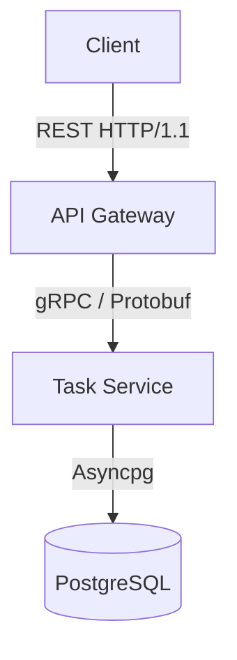

# Microservice Task Management System

A robust, asynchronous task management system originally built as a monolithic MVP and transitioned to a microservices architecture using **FastAPI**, **gRPC**, and **PostgreSQL**.

## 🏗 Architecture

The project follows a microservices pattern with a clean separation of concerns:



### Services

1.  **API Gateway** (`gateway/`)
    -   **Tech**: FastAPI
    -   **Role**: Entry point for external clients. Handles HTTP requests, validation, and routes traffic to internal gRPC services.
    -   **Port**: 8000

2.  **Task Service** (`task_service/`)
    -   **Tech**: Python, gRPC, SQLAlchemy (Async)
    -   **Role**: Core business logic and database interactions. Direct access to the `tasks` table.
    -   **Port**: 50051

3.  **Database**
    -   **Tech**: PostgreSQL 16
    -   **Port**: 5435 (exposed locally)

## 🛠 Tech Stack

-   **Language**: Python 3.12
-   **Web Framework**: FastAPI
-   **RPC Framework**: gRPC + Protobuf
-   **Database**: PostgreSQL
-   **ORM**: SQLAlchemy 2.0 (Async)
-   **Migrations**: Alembic
-   **Testing**: Pytest + Asyncio
-   **Containerization**: Docker & Docker Compose

## 🚀 Getting Started

### Prerequisites

-   Docker & Docker Compose
-   Python 3.12+

### Installation

1.  **Clone the repository**
2.  **Setup Environment**
    ```bash
    python3 -m venv venv
    source venv/bin/activate
    pip install -r requirements.txt
    ```
3.  **Start Infrastructure**
    ```bash
    docker-compose up -d
    ```

### Running the System

You need to run both the gRPC service and the API Gateway.

**1. Start Task Service (gRPC)**
```bash
export PYTHONPATH=$PYTHONPATH:$(pwd)
python3 task_service/app/main.py
```

**2. Start API Gateway (REST)**
```bash
export PYTHONPATH=$PYTHONPATH:$(pwd)
python3 -m uvicorn gateway.app.main:app --port 8000 --reload
```

## 📝 API Endpoints

-   `POST /tasks/`: Create a new task
-   `GET /tasks/`: List tasks (pagination support)
-   `PATCH /tasks/{id}/status`: Update task status
-   `GET /tasks/stats`: Get system statistics

## 🧪 Testing

Run system-wide integration tests:
```bash
pytest
```
